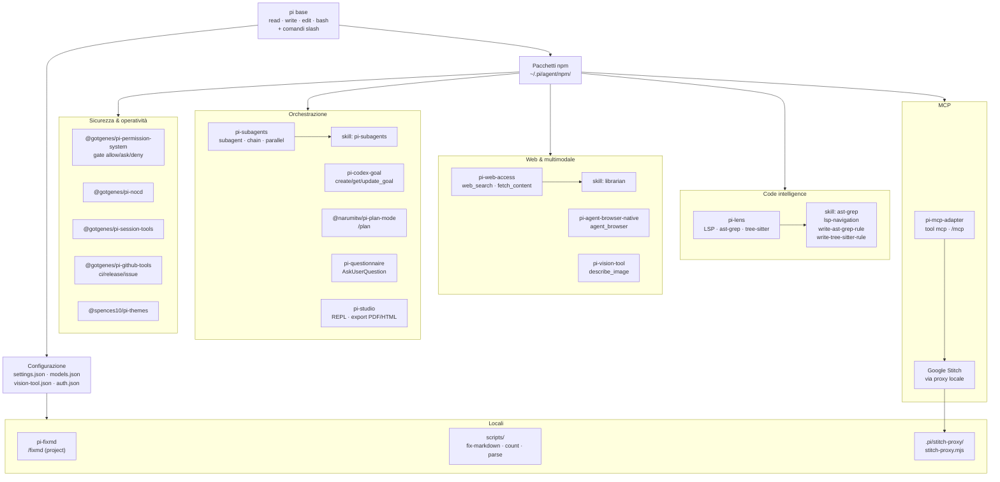

<div align="center">

# pi-lab — Configurazione avanzata e personalizzata di [pi](https://pi.dev)

Repo-template che documenta come trasformare un'installazione **base di pi** (coding agent) in una configurazione **avanzata e personalizzata**, descrivendo tutte le estensioni, plugin, skill, server MCP e configurazioni installate — con riferimento ufficiale, installazione, configurazione, uso ed esempi per ciascun componente.

[](https://pi.dev)
[](https://nodejs.org)
[](https://www.typescriptlang.org/)
[](docs/README.md)
[](docs/skills/README.md)
[](docs/README.md)
[](docs/mcp/)
[](#license)

[Panoramica](#panoramica) ·
[Perché esiste](#perché-esiste) ·
[Architettura](#architettura) ·
[Stack](#stack-tecnologico) ·
[Componenti](#componenti-installati) ·
[Avvio Rapido](#avvio-rapido) ·
[Struttura](#struttura-del-repository) ·
[Documentazione](#documentazione) ·
[License](#license)

</div>

---

## Panoramica

[pi](https://pi.dev) è un coding agent estensibile: dopo l'installazione base espone i tool built-in (`read`, `write`, `edit`, `bash`) e i comandi slash di base, **senza** estensioni. Questo repo mostra come passare da quella base a una configurazione ricca, installando **15 pacchetti** (estensioni/skill da pi.dev e npm), **6 skill** (fornite dai pacchetti, non installate separatamente), **2 estensioni locali**, la configurazione di provider/modelli e un server MCP via proxy.

Tutto è documentato, partendo da un pi appena installato e aggiungendo le parti una alla volta. Per ogni componente: **riferimento ufficiale, installazione, configurazione (con segnaposto semantici, mai segreti), uso ed esempi**.

| Area | Cosa contiene | Link |
| --- | --- | --- |
| Partenza | pi base, ambiente TUI, variabili editor | [docs/getting-started/](docs/getting-started/) |
| Configurazione | settings, models, vision-tool, permission, mcp-onboarding | [docs/config/](docs/config/) |
| Pacchetti | 15 pacchetti + panoramica monorepo gotgenes | [docs/pacchetti-npm/](docs/pacchetti-npm/) |
| Estensioni locali | pi-permission-system (globale), pi-fixmd (progetto) | [docs/estensioni-locali/](docs/estensioni-locali/) |
| Skill | 6 skill fornite dai pacchetti (librarian, ast-grep, lsp, subagents, regole) | [docs/skills/README.md](docs/skills/README.md) |
| MCP | server MCP, proxy Stitch, audit di sicurezza | [docs/mcp/](docs/mcp/) |
| Componenti locali | stitch-proxy, scripts di utilità | [docs/components-locali/](docs/components-locali/) |
| Approfondimenti | guide, confronti, analisi dei pacchetti | [docs/approfondimenti/](docs/approfondimenti/) |

## Perché esiste

Configurare un coding agent con code intelligence, web access, sub-agent, permessi, plan mode, vision e server MCP richiede di conoscere molti pacchetti, i loro file di configurazione e le loro interazioni. Questo repo:

- parte da un pi pulito e aggiunge le parti in ordine, così ogni step è comprensibile;
- dà il **riferimento ufficiale** (npm/GitHub/pi.dev) per ogni componente, così nulla è inventato;
- usa **segnaposto semantici** (`<PROVIDER_API_KEY>`, `~/.pi/agent/...`) per non esporre segreti o path specifici dell'installazione reale;
- riutilizza e adatta la documentazione già verificata nel repo, integrandola con le docs ufficiali;
- permette di **replicare o modificare** la configurazione secondo le proprie esigenze.

## Architettura



## Stack tecnologico

| Layer | Tecnologia | Riferimento |
| --- | --- | --- |
| Coding agent | pi | <https://pi.dev> · <https://github.com/earendil-works/pi-coding-agent> |
| Runtime | Node.js ≥ 22 | <https://nodejs.org> |
| Linguaggio | TypeScript | <https://www.typescriptlang.org> |
| Code intelligence | pi-lens (LSP, ast-grep, tree-sitter, biome/ruff/eslint) | <https://github.com/apmantza/pi-lens> |
| Web access | pi-web-access (OpenAI, Brave, Parallel, Tavily, Exa, Perplexity, Gemini) | <https://github.com/nicobailon/pi-web-access> |
| Browser automation | pi-agent-browser-native + agent-browser upstream | <https://github.com/fitchmultz/pi-agent-browser-native> |
| Vision | pi-vision-tool (delega a modello multimodale) | <https://github.com/xezpeleta/pi-vision-tool> |
| Sub-agent | pi-subagents (chain, parallel, async, fork) | <https://github.com/nicobailon/pi-subagents> |
| Goal tracking | pi-codex-goal (stile Codex) | <https://github.com/fitchmultz/pi-codex-goal> |
| Plan mode | @narumitw/pi-plan-mode | <https://github.com/narumiruna/pi-extensions> |
| TUI interazione | pi-questionnaire (AskUserQuestion) | <https://github.com/clankercode/pi-questionnaire> |
| Workspace/REPL | pi-studio (tmux, export PDF/HTML) | <https://github.com/omaclaren/pi-studio> |
| Sicurezza | @gotgenes/pi-permission-system + nocd + session-tools + github-tools | <https://github.com/gotgenes/pi-packages> |
| Temi | @spences10/pi-themes | <https://github.com/spences10/my-pi> |
| MCP | pi-mcp-adapter (stdio, remoto, OAuth, bearer, lifecycle) | <https://github.com/nicobailon/pi-mcp-adapter> |
| Markdown lint | markdownlint-cli2 + fix custom (MD040/MD060/MD026) | <https://github.com/DavidAnson/markdownlint-cli2> |

## Componenti installati

### Pacchetti (15)

| # | Pacchetto | Categoria | Documento |
| --- | --- | --- | --- |
| 01 | `pi-mcp-adapter` | MCP | [docs/pacchetti-npm/pi-mcp-adapter.md](docs/pacchetti-npm/pi-mcp-adapter.md) |
| 02 | `pi-lens` | Code intelligence | [docs/pacchetti-npm/pi-lens.md](docs/pacchetti-npm/pi-lens.md) |
| 03 | `pi-web-access` | Web access | [docs/pacchetti-npm/pi-web-access.md](docs/pacchetti-npm/pi-web-access.md) |
| 04 | `pi-studio` | Workspace/REPL | [docs/pacchetti-npm/pi-studio.md](docs/pacchetti-npm/pi-studio.md) |
| 05 | `pi-agent-browser-native` | Browser automation | [docs/pacchetti-npm/pi-agent-browser-native.md](docs/pacchetti-npm/pi-agent-browser-native.md) |
| 06 | `pi-vision-tool` | Multimodale | [docs/pacchetti-npm/pi-vision-tool.md](docs/pacchetti-npm/pi-vision-tool.md) |
| 07 | `pi-codex-goal` | Goal tracking | [docs/pacchetti-npm/pi-codex-goal.md](docs/pacchetti-npm/pi-codex-goal.md) |
| 08 | `pi-subagents` | Sub-agent | [docs/pacchetti-npm/pi-subagents.md](docs/pacchetti-npm/pi-subagents.md) |
| 09 | `pi-questionnaire` | TUI/interazione | [docs/pacchetti-npm/pi-questionnaire.md](docs/pacchetti-npm/pi-questionnaire.md) |
| 10 | `@gotgenes/pi-permission-system` | Sicurezza | [docs/pacchetti-npm/pi-permission-system.md](docs/pacchetti-npm/pi-permission-system.md) |
| 11 | `@gotgenes/pi-nocd` | System prompt | [docs/pacchetti-npm/pi-nocd.md](docs/pacchetti-npm/pi-nocd.md) |
| 12 | `@gotgenes/pi-session-tools` | Sessioni | [docs/pacchetti-npm/pi-session-tools.md](docs/pacchetti-npm/pi-session-tools.md) |
| 13 | `@gotgenes/pi-github-tools` | GitHub CI/release | [docs/pacchetti-npm/pi-github-tools.md](docs/pacchetti-npm/pi-github-tools.md) |
| 14 | `@narumitw/pi-plan-mode` | Plan mode | [docs/pacchetti-npm/pi-plan-mode.md](docs/pacchetti-npm/pi-plan-mode.md) |
| 15 | `@spences10/pi-themes` | Temi | [docs/pacchetti-npm/pi-themes.md](docs/pacchetti-npm/pi-themes.md) |

### Skill (6, dai pacchetti) · Estensioni locali (2) · MCP & componenti locali

| Tipo | Componente | Documento |
| --- | --- | --- |
| Skill | 6 skill **fornite dai pacchetti** (non installate separatamente): librarian, pi-subagents, ast-grep, lsp-navigation, write-ast-grep-rule, write-tree-sitter-rule | [docs/skills/README.md](docs/skills/README.md) |
| Estensione globale | pi-permission-system | [docs/pacchetti-npm/pi-permission-system.md](docs/pacchetti-npm/pi-permission-system.md) |
| Estensione progetto | pi-fixmd (`/fixmd`) | [docs/estensioni-locali/pi-fixmd.md](docs/estensioni-locali/pi-fixmd.md) |
| MCP | pi-mcp-adapter + Stitch proxy | [docs/mcp/](docs/mcp/) |
| Locale | stitch-proxy, scripts/ | [docs/components-locali/](docs/components-locali/) |

## Avvio Rapido

> Prerequisiti: pi installato, Node.js ≥ 22. Per il browser automation serve anche `agent-browser` upstream su `PATH`; per Stitch serve la chiave `STITCH_API_KEY`.

```bash
# 1) Clona il repo
git clone <REPO_URL> pi-lab
cd pi-lab

# 2) Installa i pacchetti nella directory npm di pi
cd ~/.pi/agent/npm
npm install pi-mcp-adapter pi-lens pi-web-access pi-studio \
  pi-agent-browser-native pi-vision-tool pi-codex-goal \
  pi-subagents pi-questionnaire \
  @gotgenes/pi-permission-system @gotgenes/pi-nocd \
  @gotgenes/pi-session-tools @gotgenes/pi-github-tools \
  @narumitw/pi-plan-mode @spences10/pi-themes

# 3) Elenca i pacchetti in ~/.pi/agent/settings.json → "packages" (vedi docs/config/settings.md)

# 4) Configura le credenziali in ~/.pi/agent/auth.json (segnaposto, vedi docs/config/models.md)

# 5) Avvia pi nella cartella del progetto
pi -c
```

Per usare Google Stitch (proxy locale + pi insieme):

```powershell
# imposta la chiave (scope Utente)
[Environment]::SetEnvironmentVariable('STITCH_API_KEY','<STITCH_API_KEY>','User')
# avvia proxy + pi
powershell -File .\.pi\stitch-proxy\start-pi.ps1
```

> Al primo avvio pi chiede di **fidarsi del progetto** perché sono presenti risorse in `.pi`.

## Struttura del repository

```text
pi-lab/
├── README.md                      # questo file (panoramica + indice)
├── .mcp.json                      # server MCP di progetto (Stitch via proxy)
├── .pi/
│   ├── estensioni-locali/
│   │   └── pi-fixmd/              # estensione project-local: comando /fixmd
│   └── stitch-proxy/              # proxy Stitch MCP + start-pi.ps1
├── scripts/                       # fix-markdown.cjs, count-by-ext.cjs, parse-perm-log.cjs, inspect-packages.cjs
└── docs/                          # tutta la documentazione
    ├── README.md                  # indice della documentazione
    ├── _TEMPLATE-componente.md    # template delle 5 sezioni
    ├── getting-started/            # 00-pi-base, 01-ambiente-tui, 02-variabili-editor
    ├── config/                    # settings, models, vision-tool, permission-system, mcp-onboarding
    ├── pacchetti-npm/                  # 15 pacchetti + _gotgenes-monorepo
    ├── estensioni-locali/                # pi-permission-system (globale), pi-fixmd (progetto)
    ├── skills/                    # skill (README.md = panoramica per provenienza)
    │   ├── da-pacchetti/         # 6 skill automatiche (via pi.skills)
    │   └── personali/           # skill utente esplicite (vuoto)
    ├── mcp/                       # mcp-guida, stitch-proxy, mcp-audit
    ├── components-locali/         # stitch-proxy, scripts
    └── approfondimenti/           # guide, confronti, analisi pacchetti
```

## Documentazione

L'indice completo e navigabile di tutta la documentazione è in **[docs/README.md](docs/README.md)**. Ogni voce segue lo stesso template con cinque sezioni: **Riferimento ufficiale · Installazione · Configurazione · Uso · Esempi**.

Punti di ingresso consigliati:

- **Partire da zero**: [docs/getting-started/00-pi-base.md](docs/getting-started/00-pi-base.md)
- **Configurare pi**: [docs/config/settings.md](docs/config/settings.md)
- **Aggiungere un pacchetto**: una voce qualsiasi in [docs/pacchetti-npm/](docs/pacchetti-npm/)
- **Capire le interazioni**: [docs/approfondimenti/pacchetti-analisi/00-raccomandazioni.md](docs/approfondimenti/pacchetti-analisi/00-raccomandazioni.md)

## License

La documentazione e gli script di questo repo sono distribuiti con licenza **MIT** — vedi [`LICENSE`](LICENSE).

I singoli pacchetti npm installati mantengono le rispettive licenze (prevalentemente MIT; `pi-questionnaire` è CC0-1.0 OR Unlicense). Si veda la colonna "Licenza" in ogni pagina per-componente.
